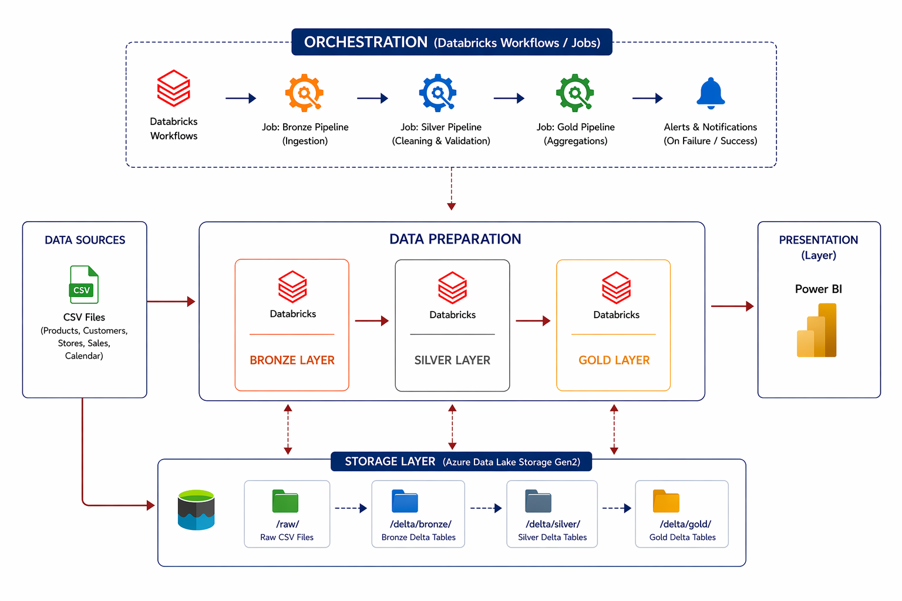
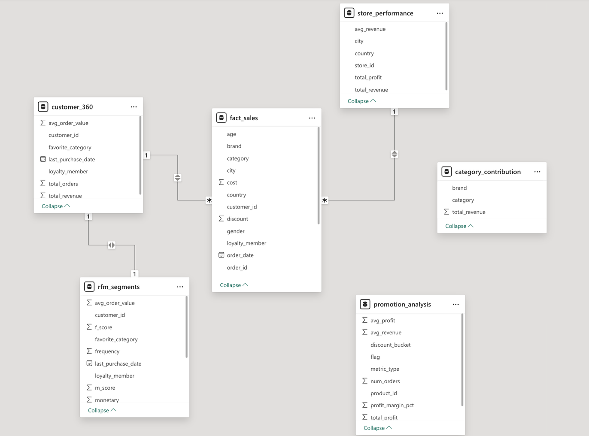
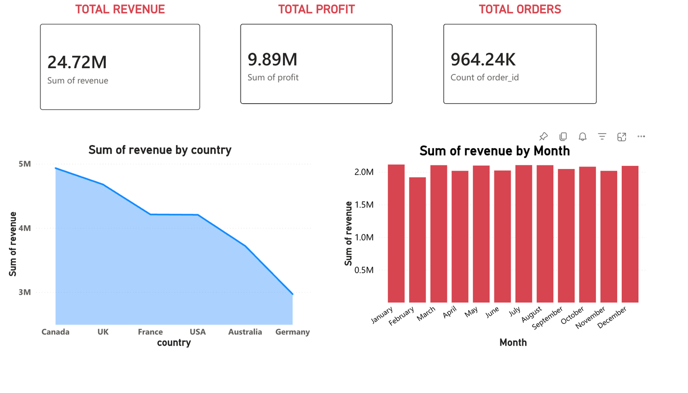
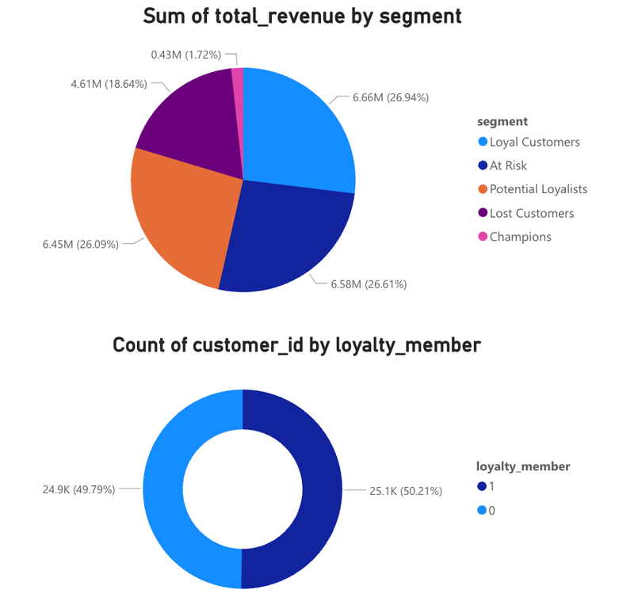
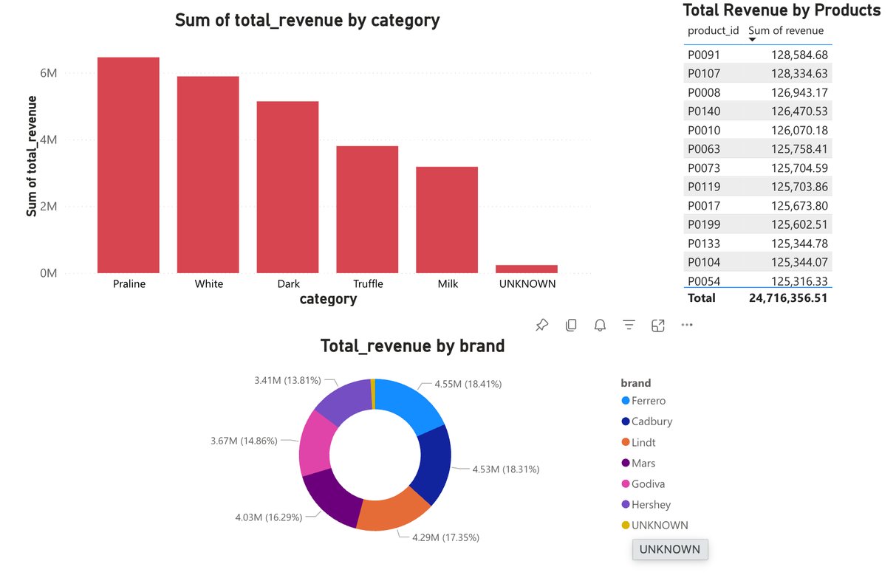
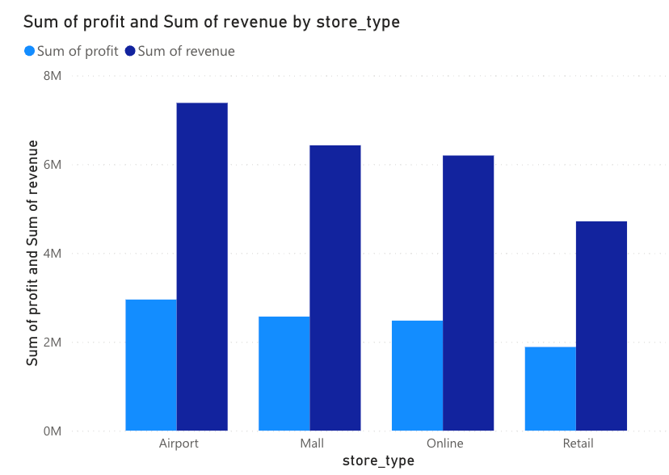
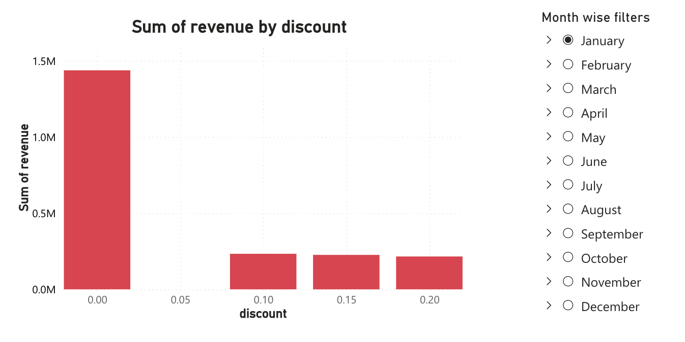

# Chocolate Retail Analytics Platform
## Azure Data Engineering Internship Project

> “Transforming raw retail data into actionable business insights”

## 🚀 Project Overview
An end-to-end retail data analytics platform built on **Databricks** and **Azure**, implementing a Medallion Lakehouse Architecture (Bronze → Silver → Gold).

This pipeline processes **1M+ records** across **100 stores** and **50K customers**, transforming fragmented data into a unified source of truth to drive business decisions regarding sales, customers, store performance, and promotions.

## 🎯 Business Problem & Objectives
**The Challenges:**
- Fragmented data across different systems.
- Blind spots in customer behavior and loyalty.
- Unoptimized promotions and discounting strategies.
- No unified visibility into store-level revenue or performance.
- Leadership lacked a single source of truth.

**Our Goals:**
1. **Build a Unified Platform:** Combine retail data centrally.
2. **Enable Scalable Processing:** Process 1M+ transactions using PySpark.
3. **Ensure Data Quality:** Validate, deduplicate, and clean raw data.
4. **Design Optimized Models:** Star schema for fast, flexible analytics.
5. **Deliver Insights:** Power BI dashboards for actionable intelligence.
6. **Optimize Performance:** Partitioning, incremental loads, and Delta formats.

## ⚙️ Tech Stack
- **Cloud Platform:** Microsoft Azure
- **Storage Layer:** Azure Data Lake Storage (ADLS) Gen2
- **Data Processing:** Databricks (Spark + Delta)
- **Data Warehouse:** Databricks Lakehouse
- **Orchestration:** Azure Data Factory / Databricks Workflows
- **Visualization:** Power BI

## 🏗️ Architecture

### The Medallion Architecture

#### 🥉 Bronze Layer (Raw Data)
- **Source:** CSV files in ADLS (`products.csv`, `customers.csv`, `stores.csv`, `sales.csv`).
- **Processing:** Incremental loads using watermarks.
- **Actions:** Add `ingestion_timestamp` and perform `MERGE` operations (Update/Insert) to Delta tables.

#### 🥈 Silver Layer (Cleaned & Conformed)
- **Standardize:** Cast correct data types (`order_date`, `qty`, `price`), ensure consistent formats.
- **Validate:** NULL checks on key fields (`order_id`, `product_id`), duplicate detection.
- **Calculate:** 
  - `Revenue = quantity × unit_price × (1 − discount)`
  - `Profit = revenue − cost`
- **Quarantine:** Split valid records to Silver tables, and invalid records to a quarantine table for audit.

#### 🥇 Gold Layer (Aggregated Business Logic)
- **Fact & Aggregations:** Unified `fact_sales`, daily & monthly aggregates.
- **Customer 360:** Unified view of orders, revenue, behavior.
- **RFM Segmentation:** Segmenting by Recency, Frequency, and Monetary value.
- **Loyalty Analysis:** Revenue impact of loyalty vs. non-loyalty members.
- **Store & Promotions:** Identify underperforming stores and analyze discount impacts on profitability.

## 🗄️ Data Model

## 📊 Analytics & Dashboards

The visualization layer in Power BI provides actionable insights across multiple dimensions:

### Sales Performance
Overall revenue and profit trends.

### Customer Analysis
Customer segments and value analysis (RFM).

### Category & Product Analysis
Category and product-level performance.

### Store Analysis
Store-wise performance and profitability.

### Promotion Analysis
Discount impact and profitability.

## 🏆 Key Deliverables & Success Metrics
1. **Unified Source of Truth:** Eliminated fragmentation variance across sources.
2. **Customer Segmentation:** Successfully implemented quartile-based RFM ranking.
3. **Category Insights:** Clear visibility into brand-category contributions.
4. **Automated Pipeline:** 8-minute runtime on Databricks Workflows with task dependencies and retry logic.

---

